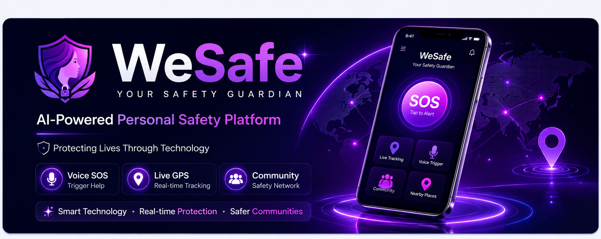

<p align="center">
  
</p>

# 💜 WeSafe - Your Safety Guardian

### AI-Powered Personal Safety Platform

> **Protecting people through AI-powered emergency assistance, real-time location tracking, voice-triggered SOS, and community-driven safety.**

---

<p align="center">

🚀 Empowering Safety with Artificial Intelligence

</p>

---

## 🌐 Explore WeSafe

🚀 **Live Demo:**  
https://wesafe-5676c.web.app

💻 **GitHub Repository:**  
https://github.com/RaginiSingh2024/WeSafe_

📄 **Project Documentation:**  
https://docs.google.com/document/d/1DecloCaOx0gtzOv-2dF9HhENjafRz-8WRGxp0vQgg3Y/edit?usp=sharing

📊 **Business Model:**  
https://docs.google.com/spreadsheets/d/1_7Oqaeg4St6jeaC_lOVf65emrQRXZtL7xg2-RU9xOTM/edit?usp=sharing

🎨 **Project Presentation (Canva/Gamma):**  
https://gamma.app/docs/WeSafe-Indias-most-reliable-personal-safety-platform-8smunllv1q2sv4c

🎥 **Product Demo Video:**  
*(Coming Soon)*

# 📖 About WeSafe

WeSafe is an AI-powered personal safety platform designed to provide fast, reliable, and intelligent emergency assistance during critical situations.

The platform combines advanced voice recognition, real-time GPS tracking, emergency SOS alerts, community safety networking, and nearby emergency services into a single application that helps users stay safe anytime and anywhere.

Unlike traditional safety applications that depend only on manual interaction, WeSafe focuses on smart automation, faster emergency response, and real-time communication to reduce response time during emergencies.

Our goal is simple—

> **Make personal safety smarter, faster, and accessible for everyone.**

---

# 🚨 Problem Statement

Personal safety remains one of today's biggest challenges, especially for women, college students, night-shift employees, solo travelers, and elderly individuals.

Most existing emergency applications rely completely on manual actions such as unlocking the phone, opening the application, and pressing an SOS button. During emergencies, these actions are often difficult or even impossible.

Additionally, many applications provide limited emergency communication, lack community-based support, and fail to deliver intelligent safety features that work automatically when users are unable to interact with their devices.

These limitations inspired us to build **WeSafe** — an intelligent safety platform that combines AI, automation, and real-time communication into one powerful application.

---

# 💡 Our Vision

We believe technology should not only connect people—it should protect them.

Our vision is to build a future where intelligent technology helps people feel safer in their everyday lives through proactive emergency detection, faster response systems, and community-powered assistance.

# 🚀 Core Features

WeSafe combines Artificial Intelligence, Location Services, Emergency Communication, and Community Support into one intelligent safety platform.

---

## 🎙️ AI Voice Trigger SOS

- Detects emergency keywords using AI-powered speech recognition.
- Supports multilingual trigger words (English, Hindi, and Marathi).
- Automatically activates SOS when danger-related keywords are detected.
- Works without requiring users to manually unlock their phones.

---

## 📍 Live GPS Tracking

- Shares the user's real-time location with emergency contacts.
- Generates Google Maps location links instantly.
- Enables family members and trusted contacts to track users during emergencies.

---

## 🚨 Smart Emergency SOS

- Sends emergency alerts with a single tap.
- Shares current GPS location automatically.
- Quickly notifies trusted emergency contacts.

---

## 👥 Community Safety Network

- Connects users with nearby verified safety communities.
- Allows emergency alerts to be shared within local safety groups.
- Enables community members to respond quickly during emergencies.

---

## 🏥 Nearby Safe Places

Quickly locate nearby:

- 🚓 Police Stations
- 🏥 Hospitals
- 💊 Medical Stores
- 🚌 Bus Stations

to receive immediate assistance.

---

## 🛡️ Stealth Protection Mode

Designed for situations where users cannot openly use their phones.

Features include:

- Hidden emergency actions
- Silent emergency activation
- Background monitoring
- Anonymous community interaction

---

## 🔐 Secure Authentication

- Firebase Authentication
- Secure user login
- Protected user information
- Cloud-based account management

---

# 🛠️ Technology Stack

## 📱 Frontend

- Flutter
- Dart

---

## ☁️ Backend

- Firebase Authentication
- Cloud Firestore
- Firebase Cloud Functions

---

## 🤖 Artificial Intelligence

- Speech Recognition
- Voice Trigger Detection
- Threat Detection Logic

---

## 📍 Location Services

- GPS Tracking
- Google Maps Integration
- Real-Time Location Sharing

---

## 💬 Communication

- SMS Emergency Alerts
- Push Notifications
- Community Messaging

---

## 💾 Local Storage

- Shared Preferences
- Local User Settings
- Emergency Contact Storage

---

# 🔄 Application Workflow

The complete working process of WeSafe is simple, intelligent, and designed for quick emergency response.

### Step 1
User logs into the application.

⬇️

### Step 2
The application continuously monitors for emergency trigger words while remaining ready in the background.

⬇️

### Step 3
If a trigger word or emergency action is detected, the AI validates the event.

⬇️

### Step 4
The user's live GPS location is captured.

⬇️

### Step 5
Emergency SOS alerts are sent to trusted contacts.

⬇️

### Step 6
Community safety members receive emergency notifications.

⬇️

### Step 7
Nearby emergency services can be accessed instantly.

⬇️

### Step 8
The user receives continuous safety support until the emergency ends.

---

## 🎯 Why WeSafe?

✅ AI-Based Emergency Detection

✅ Voice Activated SOS

✅ Live GPS Tracking

✅ Community Safety Network

✅ Smart Emergency Communication

✅ Fast Response System

✅ User-Friendly Interface

✅ Secure Cloud Infrastructure

# 📱 Application Showcase

WeSafe is designed with a modern and user-friendly interface that enables users to access emergency assistance quickly and efficiently.

The application focuses on providing a smooth user experience while ensuring that important safety features remain easily accessible during critical situations.

---

## 🖼️ Application Screens

> 📌 Screenshots will be updated soon.

Current application includes:

- 🏠 Home Dashboard
- 🚨 Emergency SOS Screen
- 🎙️ Voice Trigger Detection
- 📍 Live GPS Tracking
- 👥 Community Safety Network
- 🏥 Nearby Safe Places
- 👤 User Profile
- ⚙️ Settings

---

## 🎥 Demo Preview

A complete product demonstration video showcasing the application workflow and core features will be added soon.

The demo includes:

- Login
- Home Dashboard
- Voice Trigger SOS
- Emergency Alert
- Live GPS Tracking
- Community Safety
- Nearby Safe Places

---

# 🏗️ System Architecture

```
                  User
                    │
                    ▼
            Flutter Mobile App
                    │
     ┌──────────────┼──────────────┐
     ▼              ▼              ▼
 Firebase Auth   Firestore     GPS Services
     │              │              │
     └──────────────┼──────────────┘
                    ▼
           AI Voice Detection
                    │
                    ▼
          Emergency SOS Engine
                    │
        ┌───────────┼────────────┐
        ▼           ▼            ▼
 Emergency SMS  Live Location  Community Alerts
                    │
                    ▼
              Emergency Contacts
```

---

# ⚙️ Project Architecture

The WeSafe platform follows a modular architecture that separates the user interface, backend services, artificial intelligence modules, and emergency communication systems.

### Frontend

- Flutter
- Dart

Responsible for:

- User Interface
- Navigation
- User Experience
- Emergency Dashboard

---

### Backend

Firebase provides:

- Authentication
- Database
- Cloud Storage
- Cloud Functions

---

### AI Module

Responsible for:

- Voice Detection
- Emergency Keyword Recognition
- Threat Detection Logic

---

### Emergency Module

Responsible for:

- SOS Alerts
- GPS Tracking
- SMS Communication
- Emergency Contact Notification

---

### Community Module

Responsible for:

- Community Groups
- Safety Discussions
- Emergency Broadcasting

---

# 📂 Project Folder Structure

```
WeSafe
│
├── android/
├── ios/
├── web/
├── macos/
├── linux/
├── windows/
│
├── lib/
│   ├── screens/
│   ├── widgets/
│   ├── services/
│   ├── models/
│   ├── providers/
│   └── main.dart
│
├── assets/
│   ├── images/
│   ├── icons/
│   └── animations/
│
├── functions/
│
├── test/
│
├── README.md
├── pubspec.yaml
└── firebase.json
```

---

# 🔥 Project Highlights

✔ Cross-Platform Mobile Application

✔ AI-Based Voice Detection

✔ Smart Emergency Response

✔ Live GPS Tracking

✔ Firebase Cloud Backend

✔ Community Safety Network

✔ Secure Authentication

✔ Modern Glassmorphism UI

✔ Real-Time Communication

✔ Scalable Architecture

# ⚙️ Getting Started

Follow these steps to set up the project locally.

---

## 📋 Prerequisites

Before running the project, make sure you have the following installed on your system:

- Flutter SDK (Latest Stable Version)
- Dart SDK
- Android Studio or VS Code
- Android Emulator / Physical Android Device
- Firebase CLI
- Git

---

## 📥 Installation

### 1️⃣ Clone the Repository

```bash
git clone https://github.com/RaginiSingh2024/WeSafe_.git
```

---

### 2️⃣ Navigate to the Project

```bash
cd WeSafe_
```

---

### 3️⃣ Install Dependencies

```bash
flutter pub get
```

---

### 4️⃣ Configure Firebase

- Create a Firebase Project
- Enable Firebase Authentication
- Enable Cloud Firestore
- Add your `google-services.json`
- Configure Firebase for Flutter

---

### 5️⃣ Run the Application

```bash
flutter run
```

---

# 📦 Major Dependencies

The project uses the following Flutter packages:

- firebase_core
- firebase_auth
- cloud_firestore
- speech_to_text
- location
- shared_preferences
- vibration
- sms_advanced

Additional packages can be found inside **pubspec.yaml**.

---

# 🔒 Required Permissions

The application requires the following permissions for proper functionality.

### 🎤 Microphone

Used for:

- Voice Trigger Detection
- Emergency Keyword Recognition

---

### 📍 Location

Used for:

- Live GPS Tracking
- Emergency Location Sharing

---

### 📱 SMS

Used for:

- Sending SOS Messages
- Emergency Communication

---

### 👥 Contacts

Used for:

- Selecting Trusted Emergency Contacts

---

### 🌐 Internet

Required for:

- Firebase
- Community Features
- Authentication
- Cloud Synchronization

---

# 🚀 Future Roadmap

Our vision is to continuously improve WeSafe with intelligent safety features.

### Version 1.1

- Improved Community Safety
- Better UI Experience
- Enhanced Voice Recognition

---

### Version 2.0

- Smartwatch Support
- AI Risk Prediction
- Offline Emergency Detection
- Multi-language Expansion

---

### Version 3.0

- Police API Integration
- Smart Wearable Devices
- AI Emergency Prediction
- Global Safety Network

---

# 📈 Future Scope

WeSafe is designed as a scalable safety platform.

Future enhancements include:

- AI-powered danger prediction
- Smart wearable integration
- Automatic accident detection
- Emergency health monitoring
- Offline SOS communication
- Smart city integration
- Campus safety solutions
- Enterprise safety platform

---

# 📊 Project Status

🟢 **Current Version:** MVP v1.0

✅ Core Development Completed

✅ Firebase Integration Completed

✅ AI Voice Detection Implemented

✅ Community Safety Network Available

✅ Live Deployment Available

More exciting features are planned in future releases.

# 👨‍💻 Meet the Team

WeSafe was successfully developed through the collaborative efforts of our amazing team.

| Team Member | Role | Contribution |
|------------|------|--------------|
| **Ragini Singh** | Documentation & GitHub | Project Documentation, GitHub Repository Management, Technical Documentation, Presentation, Deployment |
| **Sweta Kadam** | Flutter Developer | Mobile Application Development, UI Implementation, Firebase Integration |
| **Riddhi Zunjarrao** | Flutter Developer | Application Development, Feature Implementation, Testing |
| **Sakshi Shingole** | Business Research | Business Model, Market Research, Financial Projection, Startup Strategy |

---

# 🤝 Contribution

We welcome ideas and suggestions that can help improve WeSafe.

If you would like to contribute:

- Fork this repository
- Create a new feature branch
- Make your changes
- Submit a Pull Request

Every contribution is appreciated and helps us build a better safety platform.

---

# 🙏 Acknowledgements

This project was developed as part of our **Entrepreneurship Startup Project**, where our goal was to build a technology-driven solution that addresses real-world safety challenges.

Special thanks to our faculty members, mentors, and everyone who supported us throughout this journey.

Most importantly, heartfelt thanks to every team member for their dedication, teamwork, and continuous support in bringing WeSafe from an idea to a fully functional application.

---

# 📜 License

This project is created for educational, research, and portfolio purposes.

All rights belong to the respective project contributors.

---

# ⭐ Support This Project

If you found **WeSafe** helpful or interesting, please consider giving this repository a **⭐ Star** on GitHub.

Your support motivates us to continue improving the project and build more impactful technology solutions.

---

# 💜 Connect With Me

👩‍💻 **Ragini Singh**

📧 Email: *(Add your email if you want)*

💼 LinkedIn: *(Add your LinkedIn Profile)*

💻 GitHub: https://github.com/RaginiSingh2024

---

# ❤️ Thank You

Thank you for visiting the **WeSafe** repository.

We hope this project demonstrates how Artificial Intelligence and modern mobile technologies can be used to create practical solutions for real-world safety challenges.

Together, let's build a safer future through innovation and technology.

---

<p align="center">

### 💜 Built with Passion by Team WeSafe 💜

**⭐ If you like this project, don't forget to Star this repository! ⭐**

</p>
